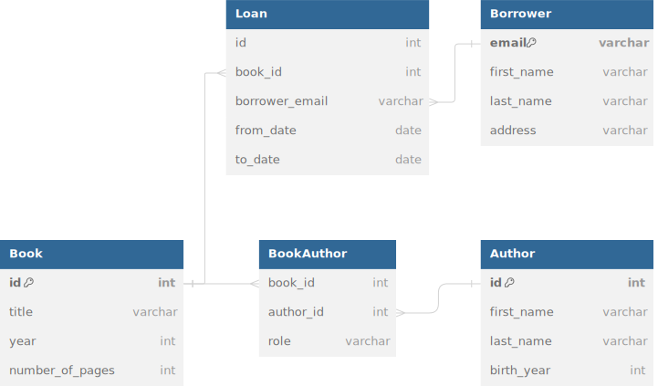

# Many-to-many with Extra Columns

Sometimes you need to have many-to-many (M:N) relations between your entity classes, with the
possibility to add extra columns inside the entity. There are several ways how to do it.
This project shows one possible solution: defining the join table (the M:N relation) itself as
a separate entity class.

# The case

We have Book entities, and Author entities. Each book can have many authors, and each
author has a specific role: (For example, writer or editor). Each author can also have authored
many books.

We also have Borrower and Loan entities. Each borrower can borrow books, this is registered as a
Loan. Each loan has a specified period: from-date and to-date. Each loan contains information about
one specific book.

# Database schema

We model this as follows in the database:

# Hints

To see exactly how the M:N relations are defined, you probably want to take a look at the
classes inside the [`model` folder](src/main/java/no/ntnu/model).

# REST API

Although this project is mainly for showing JPA database access, we use some REST API endpoints
as well to see how the data can be used and exposed. See the books at http://localhost:8080/books,
borrowers at http://localhost:8080/borrowers and loans at http://localhost:8080/loans .

# Disclaimer

This is an example used in the
course [IDATA2306 Application development](https://www.ntnu.edu/studies/courses/IDATA2306).
